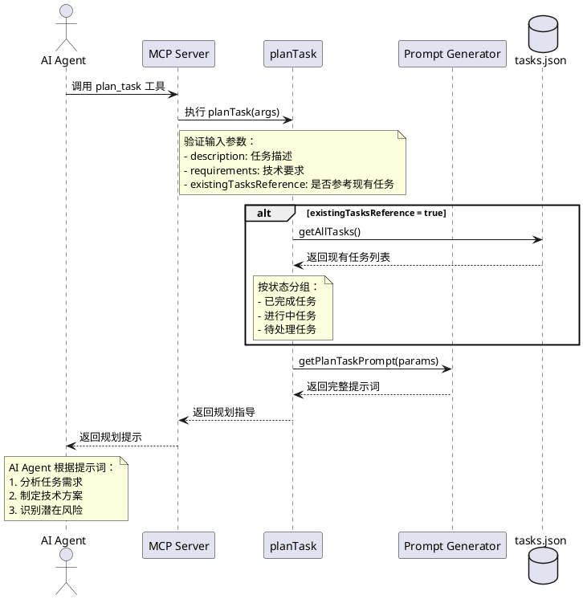
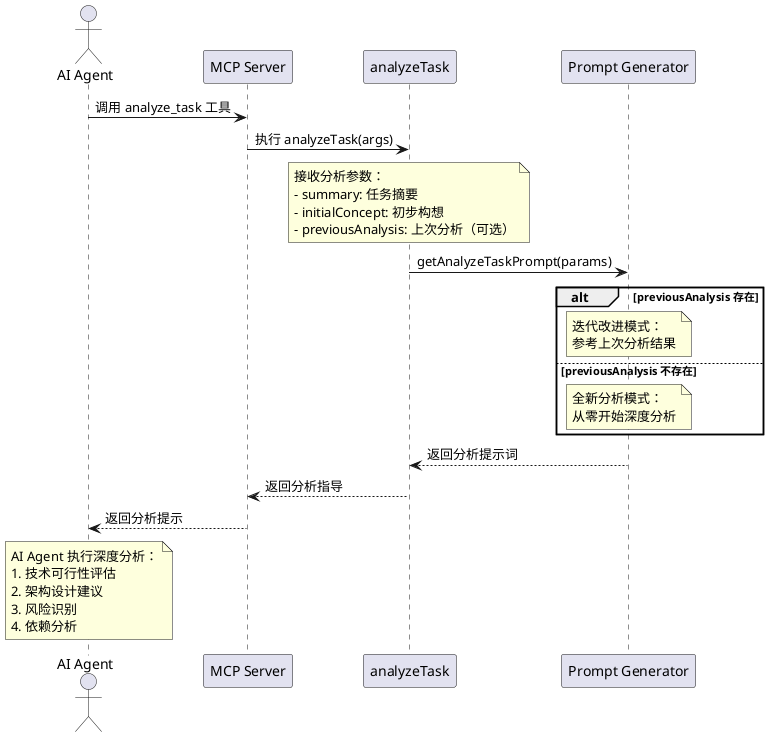
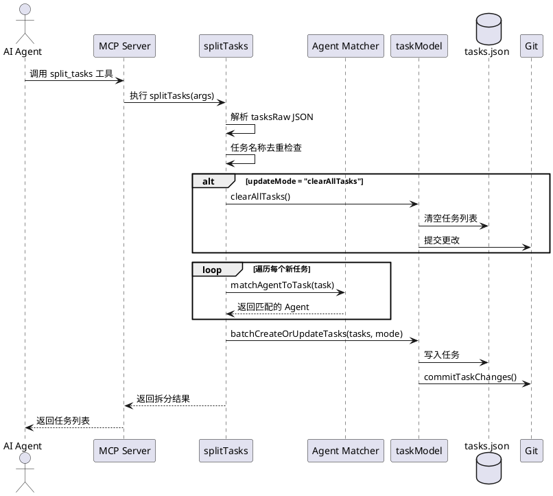
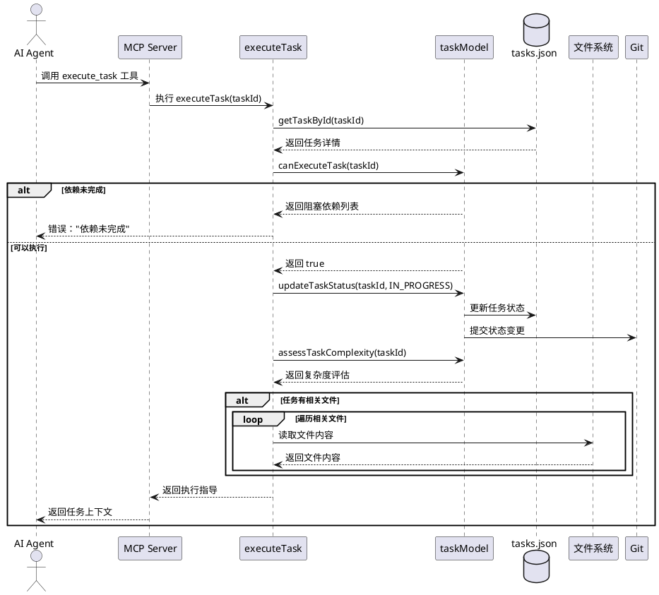
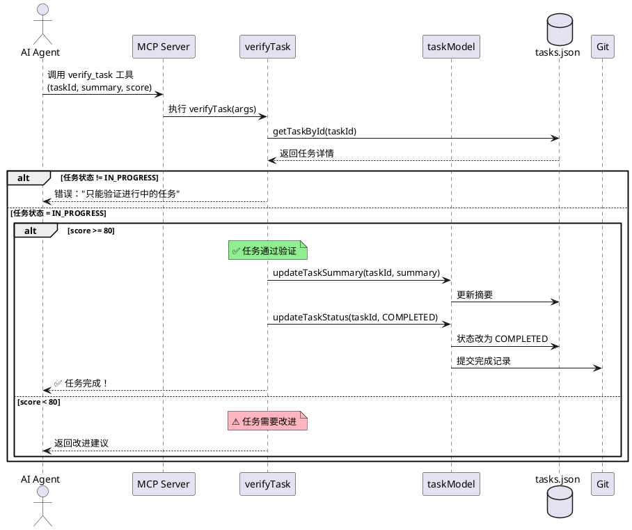
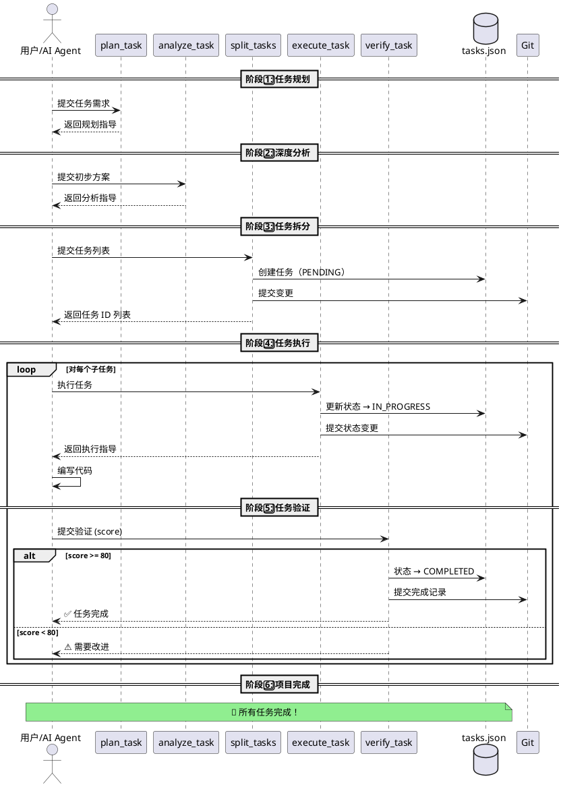

# MCP Shrimp Task Manager - 代码库学习指南

> **完整代码库学习文档**  
> 作者：AI Assistant  
> 最后更新：2025年11月5日  
> 版本：v1.0.0

---

## 📚 目录

- [第一部分：项目结构](#第一部分项目结构)
  - [1.1 顶层目录结构](#11-顶层目录结构)
  - [1.2 源代码目录详解](#12-源代码目录详解)
  - [1.3 核心文件说明](#13-核心文件说明)
- [第二部分：编译方式](#第二部分编译方式)
  - [2.1 TypeScript 编译配置](#21-typescript-编译配置)
  - [2.2 构建流程详解](#22-构建流程详解)
  - [2.3 Shebang 添加脚本](#23-shebang-添加脚本)
- [第三部分：程序入口](#第三部分程序入口)
  - [3.1 主入口文件](#31-主入口文件)
  - [3.2 MCP Server 初始化](#32-mcp-server-初始化)
  - [3.3 工具注册与调用](#33-工具注册与调用)
- [第四部分：核心逻辑](#第四部分核心逻辑)
  - [4.1 提示词生成系统](#41-提示词生成系统)
  - [4.2 任务管理模型](#42-任务管理模型)
  - [4.3 智能 Agent 匹配](#43-智能-agent-匹配)
- [第五部分：时序图](#第五部分时序图)
  - [5.1 任务规划流程](#51-任务规划流程)
  - [5.2 任务分析流程](#52-任务分析流程)
  - [5.3 任务拆分流程](#53-任务拆分流程)
  - [5.4 任务执行流程](#54-任务执行流程)
  - [5.5 任务验证流程](#55-任务验证流程)
  - [5.6 完整生命周期](#56-完整生命周期)
- [第六部分：关键实现函数](#第六部分关键实现函数)
  - [6.1 planTask - 任务规划](#61-plantask---任务规划)
  - [6.2 analyzeTask - 任务分析](#62-analyzetask---任务分析)
  - [6.3 splitTasks - 任务拆分](#63-splittasks---任务拆分)
  - [6.4 executeTask - 任务执行](#64-executetask---任务执行)
  - [6.5 verifyTask - 任务验证](#65-verifytask---任务验证)
- [附录](#附录)
  - [A. 系统架构全景图](#a-系统架构全景图)
  - [B. 关键设计模式](#b-关键设计模式)
  - [C. 快速参考表](#c-快速参考表)

---

## 第一部分：项目结构

### 1.1 顶层目录结构

```
mcp-shrimp-task-manager/
├── 📁 src/                    # 源代码目录
│   ├── index.ts              # 主入口文件
│   ├── models/               # 数据模型层
│   ├── tools/                # MCP 工具实现
│   ├── prompts/              # 提示词模板系统
│   ├── types/                # TypeScript 类型定义
│   ├── utils/                # 工具函数
│   ├── web/                  # Web GUI 服务器
│   └── public/               # 静态资源
│
├── 📁 dist/                   # 编译输出目录
│   ├── index.js              # 编译后的入口（带 shebang）
│   ├── *.d.ts                # TypeScript 类型声明
│   └── *.js.map              # Source Map 文件
│
├── 📁 docs/                   # 项目文档
│   ├── README.md
│   ├── GUIDE_*.md
│   └── CHANGELOG.md
│
├── 📁 scripts/                # 构建脚本
│   ├── add-shebang.js        # 添加 shebang 行
│   └── convert-to-simplified.js
│
├── 📁 tools/                  # 开发工具
│
├── 📄 package.json            # 项目配置
├── 📄 tsconfig.json           # TypeScript 配置
├── 📄 .gitignore              # Git 忽略规则
└── 📄 README.md               # 项目说明
```

**目录职责说明**：

| 目录 | 职责 | 重要性 |
|-----|------|--------|
| `src/` | 所有源代码 | ⭐⭐⭐⭐⭐ |
| `dist/` | 编译输出（可执行） | ⭐⭐⭐⭐ |
| `docs/` | 文档和指南 | ⭐⭐⭐ |
| `scripts/` | 构建辅助脚本 | ⭐⭐ |
| `tools/` | 开发工具 | ⭐⭐ |

---

### 1.2 源代码目录详解

```
src/
├── 📄 index.ts                          # MCP Server 主入口
│
├── 📁 models/                           # 数据模型层
│   └── taskModel.ts                    # 任务 CRUD、依赖管理、Git 集成
│
├── 📁 tools/                            # MCP 工具实现
│   ├── index.ts                        # 工具导出入口
│   ├── task/                           # 任务管理工具
│   │   ├── planTask.ts                 # 任务规划
│   │   ├── analyzeTask.ts              # 任务分析
│   │   ├── splitTasks.ts               # 任务拆分
│   │   ├── executeTask.ts              # 任务执行
│   │   ├── verifyTask.ts               # 任务验证
│   │   ├── listTasks.ts                # 任务列表
│   │   ├── queryTask.ts                # 任务搜索
│   │   ├── updateTask.ts               # 任务更新
│   │   ├── deleteTask.ts               # 任务删除
│   │   ├── getTaskDetail.ts            # 任务详情
│   │   └── clearAllTasks.ts            # 清空任务
│   │
│   ├── project/                        # 项目管理工具
│   │   └── initProjectRules.ts         # 初始化项目规范
│   │
│   ├── thought/                        # 思维链工具
│   │   └── processThought.ts           # 处理思维链
│   │
│   └── research/                       # 研究模式工具
│       ├── researchMode.ts             # 研究模式
│       └── queueResearchTask.ts        # 队列研究任务
│
├── 📁 prompts/                          # 提示词模板系统
│   ├── loader.ts                       # 模板加载器（三层查找）
│   ├── generators/                     # 提示词生成器
│   │   ├── planTask.ts                 # 规划任务提示词
│   │   ├── analyzeTask.ts              # 分析任务提示词
│   │   ├── splitTasks.ts               # 拆分任务提示词
│   │   ├── executeTask.ts              # 执行任务提示词
│   │   └── verifyTask.ts               # 验证任务提示词
│   │
│   ├── templates_en/                   # 英文模板（默认）
│   │   ├── planTask/
│   │   │   ├── index.md
│   │   │   ├── tasks.md
│   │   │   ├── hasThought.md
│   │   │   └── noThought.md
│   │   └── ...
│   │
│   └── templates_zh/                   # 中文模板
│       └── ...
│
├── 📁 types/                            # TypeScript 类型定义
│   └── index.ts                        # 核心类型（Task、Agent、RelatedFile）
│
├── 📁 utils/                            # 工具函数
│   ├── paths.ts                        # 路径管理、Server 单例
│   ├── agentMatcher.ts                 # Agent 智能匹配
│   ├── agentLoader.ts                  # Agent 加载器
│   ├── fileLoader.ts                   # 文件加载器
│   └── regex.ts                        # 正则表达式常量
│
├── 📁 web/                              # Web GUI 服务器
│   └── webServer.ts                    # Express 服务器、SSE 推送
│
└── 📁 public/                           # 静态资源
    ├── index.html                      # Web GUI 界面
    ├── script.js                       # 前端交互逻辑
    ├── styles.css                      # 界面样式
    └── locales/                        # 国际化文件
        ├── en.json
        └── zh-CN.json
```

---

### 1.3 核心文件说明

#### **index.ts** - 程序主入口
- 创建 MCP Server 实例
- 注册 15 个工具函数
- 处理工具调用请求
- 启动 Web GUI（可选）

#### **taskModel.ts** - 任务数据模型
- 任务 CRUD 操作
- 依赖关系管理
- 复杂度评估
- Git 版本控制集成

#### **agentMatcher.ts** - Agent 匹配引擎
- 8 大领域关键词映射
- 智能评分算法
- 多级降级策略

#### **loader.ts** - 提示词模板系统
- 三层查找策略
- 动态参数注入
- 环境变量覆盖

---

## 第二部分：编译方式

### 2.1 TypeScript 编译配置

**文件位置**：`tsconfig.json`

```json
{
  "compilerOptions": {
    "target": "ES2022",                // 编译目标：现代 JavaScript
    "module": "NodeNext",              // 模块系统：Node.js ESM
    "moduleResolution": "NodeNext",    // 模块解析：Node.js 风格
    "outDir": "./dist",                // 输出目录
    "rootDir": "./src",                // 源码根目录
    "declaration": true,               // 生成 .d.ts 类型声明
    "sourceMap": true,                 // 生成 Source Map
    "strict": true,                    // 启用严格模式
    "esModuleInterop": true,           // ES 模块互操作
    "skipLibCheck": true,              // 跳过库类型检查
    "forceConsistentCasingInFileNames": true,
    "resolveJsonModule": true,         // 支持导入 JSON
    "allowSyntheticDefaultImports": true
  },
  "include": ["src/**/*"],
  "exclude": ["node_modules", "dist", "**/*.test.ts"]
}
```

**关键配置解析**：

| 配置项 | 值 | 作用 |
|-------|---|------|
| `target` | ES2022 | 使用最新 JavaScript 特性 |
| `module` | NodeNext | Node.js 原生 ESM 支持 |
| `declaration` | true | 生成类型声明文件（`.d.ts`） |
| `sourceMap` | true | 支持调试时映射回源码 |
| `strict` | true | 严格类型检查，提高代码质量 |

---

### 2.2 构建流程详解

**构建命令**：`npm run build`

**完整流程**：

```bash
# 1️⃣ TypeScript 编译
tsc
  └─ 输出：dist/*.js、dist/*.d.ts、dist/*.js.map

# 2️⃣ 复制 Markdown 模板
copyfiles -u 1 "src/**/*.md" dist
  └─ 输出：dist/prompts/templates_*/*.md

# 3️⃣ 复制静态资源
copyfiles -u 1 "src/public/**/*" dist
  └─ 输出：dist/public/*

# 4️⃣ 添加 Shebang 行
node scripts/add-shebang.js
  └─ 修改：dist/index.js（添加 #!/usr/bin/env node）
```

**构建产物结构**：

```
dist/
├── index.js              # #!/usr/bin/env node（可执行）
├── index.d.ts            # 类型声明
├── index.js.map          # Source Map
├── models/
│   ├── taskModel.js
│   ├── taskModel.d.ts
│   └── taskModel.js.map
├── tools/
│   └── ...
├── prompts/
│   ├── templates_en/     # 📝 复制的模板
│   └── templates_zh/
└── public/               # 🎨 复制的静态资源
    ├── index.html
    └── ...
```

---

### 2.3 Shebang 添加脚本

**文件位置**：`scripts/add-shebang.js`

```javascript
import fs from "fs";

const filePath = "./dist/index.js";
const shebang = "#!/usr/bin/env node\n";

let content = fs.readFileSync(filePath, "utf8");

if (!content.startsWith(shebang)) {
  content = shebang + content;
  fs.writeFileSync(filePath, content);
  console.log("✅ Shebang added to dist/index.js");
} else {
  console.log("ℹ️ Shebang already present.");
}
```

**作用**：
- 使 `dist/index.js` 成为可直接执行的脚本
- 支持 `./dist/index.js` 或 `node dist/index.js` 运行
- Linux/macOS 可通过 `chmod +x dist/index.js` 添加执行权限

---

## 第三部分：程序入口

### 3.1 主入口文件

**文件位置**：`src/index.ts`

**核心导入**：

```typescript
import dotenv from "dotenv/config";  // 环境变量加载
import { Server } from "@modelcontextprotocol/sdk/server/index.js";
import { StdioServerTransport } from "@modelcontextprotocol/sdk/server/stdio.js";
import {
  CallToolRequestSchema,
  ListToolsRequestSchema,
} from "@modelcontextprotocol/sdk/types.js";
import { zodToJsonSchema } from "zod-to-json-schema";

// 工具函数和 Schema
import {
  planTask,
  planTaskSchema,
  analyzeTask,
  analyzeTaskSchema,
  // ... 其他 13 个工具
} from "./tools/index.js";

// 辅助函数
import { setGlobalServer } from "./utils/paths.js";
import { createWebServer } from "./web/webServer.js";
import { loadPromptFromTemplate } from "./prompts/loader.js";
```

---

### 3.2 MCP Server 初始化

```typescript
async function main() {
  const ENABLE_GUI = process.env.ENABLE_GUI === "true";
  let webServerInstance: Awaited<ReturnType<typeof createWebServer>> | null = null;

  // 📌 创建 MCP Server
  const server = new Server(
    {
      name: "Shrimp Task Manager",
      version: "1.0.0",
    },
    {
      capabilities: {
        tools: {},      // 支持工具调用
        logging: {},    // 支持日志记录
      },
    }
  );

  // 📌 设置全局单例（供其他模块使用）
  setGlobalServer(server);

  // 📌 启动 Web GUI（可选）
  if (ENABLE_GUI) {
    server.setNotificationHandler(InitializedNotificationSchema, async () => {
      try {
        webServerInstance = await createWebServer();
        await webServerInstance.startServer();
      } catch (error) {
        console.error("Failed to start web server:", error);
      }
    });
  }

  // ... 注册工具和处理请求
}
```

**Server 配置说明**：

| 字段 | 值 | 说明 |
|-----|---|------|
| `name` | "Shrimp Task Manager" | MCP 服务名称 |
| `version` | "1.0.0" | 版本号 |
| `capabilities.tools` | {} | 声明支持工具调用 |
| `capabilities.logging` | {} | 声明支持日志 |

---

### 3.3 工具注册与调用

#### **工具列表注册**（ListToolsRequest）

```typescript
server.setRequestHandler(ListToolsRequestSchema, async () => {
  return {
    tools: [
      {
        name: "plan_task",
        description: await loadPromptFromTemplate("toolsDescription/planTask.md"),
        inputSchema: zodToJsonSchema(planTaskSchema),
      },
      {
        name: "analyze_task",
        description: await loadPromptFromTemplate("toolsDescription/analyzeTask.md"),
        inputSchema: zodToJsonSchema(analyzeTaskSchema),
      },
      // ... 其他 13 个工具
      {
        name: "verify_task",
        description: await loadPromptFromTemplate("toolsDescription/verifyTask.md"),
        inputSchema: zodToJsonSchema(verifyTaskSchema),
      },
    ],
  };
});
```

**15 个工具清单**：

| 序号 | 工具名称 | 功能 | Schema |
|-----|---------|------|--------|
| 1 | `plan_task` | 任务规划 | planTaskSchema |
| 2 | `analyze_task` | 任务分析 | analyzeTaskSchema |
| 3 | `split_tasks` | 任务拆分 | splitTasksSchema |
| 4 | `execute_task` | 任务执行 | executeTaskSchema |
| 5 | `verify_task` | 任务验证 | verifyTaskSchema |
| 6 | `list_tasks` | 任务列表 | listTasksSchema |
| 7 | `query_task` | 任务搜索 | queryTaskSchema |
| 8 | `get_task_detail` | 任务详情 | getTaskDetailSchema |
| 9 | `update_task` | 任务更新 | updateTaskSchema |
| 10 | `delete_task` | 任务删除 | deleteTaskSchema |
| 11 | `clear_all_tasks` | 清空任务 | clearAllTasksSchema |
| 12 | `process_thought` | 思维链处理 | processThoughtSchema |
| 13 | `research_mode` | 研究模式 | researchModeSchema |
| 14 | `init_project_rules` | 初始化项目规范 | initProjectRulesSchema |
| 15 | `queue_research_task` | 队列研究任务 | queueResearchTaskSchema |

---

#### **工具调用处理**（CallToolRequest）

```typescript
server.setRequestHandler(CallToolRequestSchema, async (request: CallToolRequest) => {
  try {
    if (!request.params.arguments) {
      throw new Error("No arguments provided");
    }

    let parsedArgs;
    
    // 📌 路由到具体工具函数
    switch (request.params.name) {
      case "plan_task":
        parsedArgs = await planTaskSchema.safeParseAsync(request.params.arguments);
        if (!parsedArgs.success) {
          throw new Error(`Invalid arguments: ${parsedArgs.error.message}`);
        }
        return await planTask(parsedArgs.data);

      case "split_tasks":
        parsedArgs = await splitTasksSchema.safeParseAsync(request.params.arguments);
        if (!parsedArgs.success) {
          throw new Error(`Invalid arguments: ${parsedArgs.error.message}`);
        }
        return await splitTasks(parsedArgs.data);

      // ... 其他 13 个 case

      default:
        throw new Error(`Tool ${request.params.name} does not exist`);
    }
  } catch (error) {
    const errorMsg = error instanceof Error ? error.message : String(error);
    return {
      content: [{
        type: "text",
        text: `Error occurred: ${errorMsg}\nPlease try correcting the error and calling the tool again`,
      }],
    };
  }
});
```

**调用流程**：

```
AI Agent 发送请求
    ↓
MCP Server 接收
    ↓
路由到对应工具
    ↓
Zod Schema 验证参数
    ├─ 验证失败 → 返回错误
    └─ 验证成功 → 执行工具函数
        ↓
    返回结果给 AI Agent
```

---

#### **建立连接**

```typescript
// 📌 使用标准输入输出作为传输通道
const transport = new StdioServerTransport();
await server.connect(transport);

console.log("MCP Server started successfully");
```

**传输方式**：
- **StdioServerTransport**：通过标准输入输出与 AI Agent 通信
- 支持 JSON-RPC 2.0 协议
- 适用于本地工具集成

---

## 第四部分：核心逻辑

### 4.1 提示词生成系统

#### **三层查找策略**

**实现位置**：`src/prompts/loader.ts`

```typescript
export async function loadPromptFromTemplate(templatePath: string): Promise<string> {
  const templateSetName = process.env.TEMPLATES_USE || "en";
  const dataDir = await getDataDir();
  
  // 1️⃣ 第一层：自定义模板（DATA_DIR/zh/planTask/index.md）
  const customFilePath = path.resolve(dataDir, templateSetName, templatePath);
  if (fs.existsSync(customFilePath)) {
    return fs.readFileSync(customFilePath, "utf-8");
  }
  
  // 2️⃣ 第二层：语言特定内置模板（src/prompts/templates_zh/planTask/index.md）
  const specificBuiltInFilePath = path.join(
    __dirname, `templates_${templateSetName}`, templatePath
  );
  if (fs.existsSync(specificBuiltInFilePath)) {
    return fs.readFileSync(specificBuiltInFilePath, "utf-8");
  }
  
  // 3️⃣ 第三层：默认英文模板（src/prompts/templates_en/planTask/index.md）
  if (templateSetName !== "en") {
    const defaultBuiltInFilePath = path.join(__dirname, "templates_en", templatePath);
    if (fs.existsSync(defaultBuiltInFilePath)) {
      return fs.readFileSync(defaultBuiltInFilePath, "utf-8");
    }
  }
  
  throw new Error("Template not found");
}
```

**查找优先级**：

```
自定义模板（用户） > 语言特定模板 > 英文默认模板
```

---

#### **动态参数注入**

```typescript
export function generatePrompt(
  promptTemplate: string,
  params: Record<string, any> = {}
): string {
  let result = promptTemplate;
  
  Object.entries(params).forEach(([key, value]) => {
    const replacementValue = value !== undefined && value !== null ? String(value) : "";
    const placeholder = new RegExp(`\\{${key}\\}`, "g");
    result = result.replace(placeholder, replacementValue);
  });
  
  return result;
}
```

**使用示例**：

```typescript
const template = "你好 {name}，你的任务是 {task}";
const params = { name: "张三", task: "完成代码审查" };
const result = generatePrompt(template, params);
// 结果: "你好 张三，你的任务是 完成代码审查"
```

---

#### **环境变量覆盖**

```typescript
export function loadPrompt(basePrompt: string, promptKey: string): string {
  const envKey = promptKey.toUpperCase();
  
  // 完全替换模式: MCP_PROMPT_PLANTASK
  const overrideEnvVar = `MCP_PROMPT_${envKey}`;
  if (process.env[overrideEnvVar]) {
    return processEnvString(process.env[overrideEnvVar]);
  }
  
  // 追加模式: MCP_PROMPT_PLANTASK_APPEND
  const appendEnvVar = `MCP_PROMPT_${envKey}_APPEND`;
  if (process.env[appendEnvVar]) {
    return `${basePrompt}\n\n${processEnvString(process.env[appendEnvVar])}`;
  }
  
  return basePrompt;
}
```

**使用场景**：

```bash
# 场景1: 完全自定义提示词
export MCP_PROMPT_PLANTASK="你的自定义提示词内容"

# 场景2: 在原有提示词基础上追加内容
export MCP_PROMPT_PLANTASK_APPEND="额外的约束条件\n- 必须使用 TypeScript"
```

---

### 4.2 任务管理模型

#### **依赖检查机制**

**实现位置**：`src/models/taskModel.ts`

```typescript
export async function canExecuteTask(
  taskId: string
): Promise<{ canExecute: boolean; blockedBy?: string[] }> {
  const task = await getTaskById(taskId);
  if (!task) return { canExecute: false };

  // ✅ 已完成的任务不需要再执行
  if (task.status === TaskStatus.COMPLETED) {
    return { canExecute: false };
  }

  // ✅ 没有依赖的任务可以直接执行
  if (task.dependencies.length === 0) {
    return { canExecute: true };
  }

  const allTasks = await readTasks();
  const blockedBy: string[] = [];

  // 📌 检查每个依赖任务的状态
  for (const dependency of task.dependencies) {
    const dependencyTask = allTasks.find((t) => t.id === dependency.taskId);
    if (!dependencyTask || dependencyTask.status !== TaskStatus.COMPLETED) {
      blockedBy.push(dependency.taskId);
    }
  }

  return {
    canExecute: blockedBy.length === 0,
    blockedBy: blockedBy.length > 0 ? blockedBy : undefined,
  };
}
```

**逻辑流程**：

```
输入 taskId
    ↓
任务存在？
    ├─ 否 → 返回 { canExecute: false }
    └─ 是
        ↓
    任务已完成？
        ├─ 是 → 返回 { canExecute: false }
        └─ 否
            ↓
        有依赖任务？
            ├─ 否 → 返回 { canExecute: true }
            └─ 是
                ↓
            所有依赖都已完成？
                ├─ 是 → 返回 { canExecute: true }
                └─ 否 → 返回 { canExecute: false, blockedBy: [...] }
```

---

#### **任务复杂度评估**

```typescript
export async function assessTaskComplexity(
  taskId: string
): Promise<TaskComplexityAssessment | null> {
  const task = await getTaskById(taskId);
  if (!task) return null;

  // 📊 评估各项指标
  const descriptionLength = task.description.length;
  const dependenciesCount = task.dependencies.length;
  const notesLength = task.notes ? task.notes.length : 0;

  let level = TaskComplexityLevel.LOW;

  // 📌 1. 描述长度评估
  if (descriptionLength >= TaskComplexityThresholds.DESCRIPTION_LENGTH.VERY_HIGH) {
    level = TaskComplexityLevel.VERY_HIGH;
  } else if (descriptionLength >= TaskComplexityThresholds.DESCRIPTION_LENGTH.HIGH) {
    level = TaskComplexityLevel.HIGH;
  } else if (descriptionLength >= TaskComplexityThresholds.DESCRIPTION_LENGTH.MEDIUM) {
    level = TaskComplexityLevel.MEDIUM;
  }

  // 📌 2. 依赖数量评估（取最高级别）
  if (dependenciesCount >= TaskComplexityThresholds.DEPENDENCIES_COUNT.VERY_HIGH) {
    level = TaskComplexityLevel.VERY_HIGH;
  }
  // ... 其他评估逻辑

  return { level, metrics, recommendations };
}
```

**复杂度阈值**：

| 维度 | 低 | 中 | 高 | 极高 |
|-----|---|---|---|-----|
| **描述长度** | 0-199字 | 200-499字 | 500-999字 | ≥1000字 |
| **依赖数量** | 0-1个 | 2-3个 | 4-5个 | ≥6个 |
| **注记长度** | 0-299字 | 300-699字 | 700-1199字 | ≥1200字 |

---

#### **Git 版本控制集成**

```typescript
// Git 初始化
async function initGitIfNeeded(dataDir: string): Promise<void> {
  const gitDir = path.join(dataDir, '.git');
  try {
    await fs.access(gitDir);
    // Git 已初始化
  } catch {
    // 初始化 Git 仓库
    await execAsync(`cd "${dataDir}" && git init`);
    await execAsync(`cd "${dataDir}" && git config user.name "Shrimp Task Manager"`);
    await execAsync(`cd "${dataDir}" && git config user.email "shrimp@task-manager.local"`);
    
    // 创建 .gitignore
    await fs.writeFile(path.join(dataDir, '.gitignore'), gitignoreContent);
    
    // 初始提交
    await execAsync(`cd "${dataDir}" && git add .`);
    await execAsync(`cd "${dataDir}" && git commit -m "Initial commit"`);
  }
}

// Git 提交变更
async function commitTaskChanges(dataDir: string, message: string): Promise<void> {
  try {
    await execAsync(`cd "${dataDir}" && git add tasks.json`);
    const { stdout } = await execAsync(`cd "${dataDir}" && git status --porcelain tasks.json`);
    
    if (stdout.trim()) {
      const timestamp = getLocalISOString();
      const commitMessage = `[${timestamp}] ${message}`;
      await execAsync(`cd "${dataDir}" && git commit -m "${commitMessage}"`);
    }
  } catch (error) {
    console.error('Git commit error:', error);
  }
}
```

**Git 集成价值**：

✅ **版本追踪**：每次任务变更都自动提交  
✅ **时间戳记录**：提交信息包含精确时间  
✅ **可回溯**：可查看任务完整历史  
✅ **非阻塞**：Git 失败不影响主流程  

---

### 4.3 智能 Agent 匹配

#### **关键词映射配置**

**实现位置**：`src/utils/agentMatcher.ts`

```typescript
const AGENT_KEYWORD_MAPPINGS: AgentKeywordMap = {
  frontend: {
    keywords: [
      'frontend', 'front-end', 'ui', 'ux', 'react', 'vue', 'angular',
      'css', 'html', 'javascript', 'typescript', 'component'
    ],
    weight: 1.0
  },
  backend: {
    keywords: [
      'backend', 'back-end', 'server', 'api', 'rest', 'graphql',
      'node', 'express', 'python', 'django', 'authentication'
    ],
    weight: 1.0
  },
  fullstack: {
    keywords: [
      'fullstack', 'full-stack', 'end-to-end', 'architecture',
      'docker', 'kubernetes', 'ci/cd', 'cloud'
    ],
    weight: 1.2  // 全栈权重更高
  },
  // ... 其他类型
};
```

**8 大领域**：

| Agent 类型 | 关键词数量 | 权重 | 特点 |
|-----------|-----------|------|------|
| Frontend | 26个 | 1.0 | 覆盖主流框架 |
| Backend | 35个 | 1.0 | 多种语言和框架 |
| Database | 45个 | 1.0 | SQL 和 NoSQL |
| Fullstack | 20个 | **1.2** | 综合性高 |
| Security | 26个 | **1.1** | 关键领域 |
| Testing | 30个 | 1.0 | 测试工具 |
| Mobile | 20个 | 1.0 | 移动开发 |
| Data | 27个 | 1.0 | 数据科学 |

---

#### **关键词评分算法**

```typescript
function calculateKeywordScore(
  text: string, 
  keywords: string[], 
  weight: number, 
  agentType?: string
): number {
  const lowerText = text.toLowerCase();
  let score = 0;
  
  for (const keyword of keywords) {
    // 📌 使用正则进行全词匹配
    const regex = new RegExp(`\\b${keyword}\\b`, 'gi');
    const matches = lowerText.match(regex);
    
    if (matches) {
      let keywordScore = matches.length * weight;
      
      // 🎯 特殊关键词加权
      if (agentType === 'testing' && ['test', 'jest'].includes(keyword)) {
        keywordScore *= 3;  // 核心关键词×3
      }
      
      score += keywordScore;
    }
  }
  
  // 🎁 多关键词匹配奖励
  const uniqueMatched = keywords.filter(k => 
    new RegExp(`\\b${k}\\b`, 'i').test(lowerText)
  ).length;
  
  if (uniqueMatched > 1) {
    score += (uniqueMatched - 1) * 0.5 * weight;
  }
  
  return score;
}
```

**评分机制**：

1. **全词匹配**：`\b` 词边界避免误匹配
2. **多次出现累加**：同一关键词出现多次，分数累加
3. **特殊加权**：核心关键词 ×2 或 ×3
4. **多样性奖励**：匹配不同关键词越多，额外加分

---

#### **Agent 匹配主函数**

```typescript
export function matchAgentToTask(task: Task, availableAgents: Agent[]): string | undefined {
  // 📌 步骤1: 识别最佳 Agent 类型
  const bestAgentType = findBestAgentType(task);
  if (!bestAgentType) return undefined;
  
  // 📌 步骤2: 名称直接匹配
  let matched = availableAgents.find(agent => 
    agent.name.toLowerCase().includes(bestAgentType.type)
  );
  if (matched) return matched.name;
  
  // 📌 步骤3: 基于关键词评分
  const typeKeywords = AGENT_KEYWORD_MAPPINGS[bestAgentType.type]?.keywords || [];
  const agentScores = availableAgents.map(agent => {
    let score = 0;
    for (const keyword of typeKeywords) {
      if (new RegExp(`\\b${keyword}\\b`, 'i').test(agent.name)) {
        score += 2;
      }
    }
    return { agent, score };
  }).filter(item => item.score > 0);
  
  if (agentScores.length > 0) {
    agentScores.sort((a, b) => b.score - a.score);
    return agentScores[0].agent.name;
  }
  
  // 📌 步骤4: 检查描述字段
  for (const agent of availableAgents) {
    if (agent.description) {
      for (const keyword of typeKeywords) {
        if (new RegExp(`\\b${keyword}\\b`, 'i').test(agent.description)) {
          return agent.name;
        }
      }
    }
  }
  
  // 📌 步骤5: 降级到通用 Agent
  const general = availableAgents.find(a => a.name.includes('general'));
  if (general && bestAgentType.score >= 2.0) {
    return general.name;
  }
  
  return undefined;
}
```

**匹配策略**（优先级从高到低）：

| 优先级 | 匹配方式 | 示例 |
|-------|---------|-----|
| **1** | Agent 名称包含类型 | `"Frontend Developer"` ← `frontend` |
| **2** | Agent 名称包含关键词 | `"React Expert"` ← `react` |
| **3** | Agent 描述包含关键词 | 描述含 `"Vue specialist"` |
| **4** | 通用 Agent 降级 | `"General Agent"` |

---

## 第五部分：时序图

### 5.1 任务规划流程

**业务场景**：AI Agent 接收用户任务需求，进行规划和分析。



**关键流程**：
1. 参数验证（Zod Schema）
2. 条件性加载现有任务
3. 动态生成提示词
4. 返回规划指导

---

### 5.2 任务分析流程

**业务场景**：对规划好的任务进行深入技术分析。



---

### 5.3 任务拆分流程

**业务场景**：将大任务拆分为可执行的子任务。



**关键步骤**：
1. 任务去重检查
2. 智能 Agent 匹配
3. 批量创建/更新
4. Git 版本控制

---

### 5.4 任务执行流程

**业务场景**：执行具体任务，包括依赖检查和文件加载。



---

### 5.5 任务验证流程

**业务场景**：验证任务完成质量，决定是否标记为完成。



**评分机制**：
- **≥80 分**：自动标记为 `COMPLETED`
- **<80 分**：保持 `IN_PROGRESS`，需要改进

---

### 5.6 完整生命周期

**业务场景**：展示任务从创建到完成的完整流程。



**完整生命周期总结**：

| 阶段 | 工具 | 输入 | 输出 | 状态变化 |
|------|------|------|------|----------|
| 1️⃣ 规划 | plan_task | 需求描述 | 规划指导 | - |
| 2️⃣ 分析 | analyze_task | 初步方案 | 分析指导 | - |
| 3️⃣ 拆分 | split_tasks | 任务列表 | 任务ID列表 | 创建任务（PENDING） |
| 4️⃣ 执行 | execute_task | 任务ID | 执行指导 | PENDING → IN_PROGRESS |
| 5️⃣ 验证 | verify_task | 任务ID + 评分 | 验证结果 | IN_PROGRESS → COMPLETED (≥80分) |

---

## 第六部分：关键实现函数

### 6.1 planTask - 任务规划

**文件位置**：`src/tools/task/planTask.ts`

**Zod Schema**：

```typescript
export const planTaskSchema = z.object({
  description: z.string().min(10).describe("完整详细的任务问题描述"),
  requirements: z.string().optional().describe("特定技术要求"),
  existingTasksReference: z.boolean().optional().default(false)
    .describe("是否参考现有任务"),
});
```

**核心实现**：

```typescript
export async function planTask({
  description,
  requirements,
  existingTasksReference = false,
}: z.infer<typeof planTaskSchema>) {
  
  // 📌 步骤1: 初始化路径
  const MEMORY_DIR = await getMemoryDir();

  // 📌 步骤2: 准备任务上下文
  let completedTasks: Task[] = [];
  let pendingTasks: Task[] = [];

  if (existingTasksReference) {
    const allTasks = await getAllTasks();
    completedTasks = allTasks.filter(t => t.status === TaskStatus.COMPLETED);
    pendingTasks = allTasks.filter(t => t.status !== TaskStatus.COMPLETED);
  }

  // 📌 步骤3: 生成提示词
  const prompt = await getPlanTaskPrompt({
    description,
    requirements,
    existingTasksReference,
    completedTasks,
    pendingTasks,
    memoryDir: MEMORY_DIR,
  });

  return {
    content: [{ type: "text" as const, text: prompt }],
  };
}
```

**参数详解**：

| 参数 | 类型 | 必填 | 验证规则 | 用途 |
|-----|------|------|---------|-----|
| `description` | string | ✅ | 最少10字符 | 任务详细描述 |
| `requirements` | string | ❌ | 无限制 | 技术要求和约束 |
| `existingTasksReference` | boolean | ❌ | 默认 false | 是否参考现有任务 |

---

### 6.2 analyzeTask - 任务分析

**文件位置**：`src/tools/task/analyzeTask.ts`

**Zod Schema**：

```typescript
export const analyzeTaskSchema = z.object({
  summary: z.string().min(10).describe("结构化的任务摘要"),
  initialConcept: z.string().min(50).describe(
    "初步解答构想，包含技术方案、架构设计"
  ),
  previousAnalysis: z.string().optional().describe(
    "前次迭代的分析结果，用于持续改进"
  ),
});
```

**核心实现**：

```typescript
export async function analyzeTask({
  summary,
  initialConcept,
  previousAnalysis,
}: z.infer<typeof analyzeTaskSchema>) {
  
  const prompt = await getAnalyzeTaskPrompt({
    summary,
    initialConcept,
    previousAnalysis,
  });

  return {
    content: [{ type: "text" as const, text: prompt }],
  };
}
```

**设计亮点**：
- ✅ 支持迭代优化（`previousAnalysis`）
- ✅ 推荐使用 pseudocode
- ✅ 最少50字符保证方案完整性

---

### 6.3 splitTasks - 任务拆分

**文件位置**：`src/tools/task/splitTasks.ts`

**Zod Schema（简化）**：

```typescript
export const splitTasksSchema = z.object({
  updateMode: z.enum(["append", "overwrite", "selective", "clearAllTasks"]),
  tasks: z.array(z.object({
    name: z.string().max(100),
    description: z.string().min(10),
    implementationGuide: z.string(),
    dependencies: z.array(z.string()).optional(),
    notes: z.string().optional(),
    relatedFiles: z.array(z.object({
      path: z.string(),
      type: z.nativeEnum(RelatedFileType),
      description: z.string(),
      lineStart: z.number().optional(),
      lineEnd: z.number().optional(),
    })).optional(),
    verificationCriteria: z.string().optional(),
  })).min(1),
  globalAnalysisResult: z.string().optional(),
});
```

**核心实现**：

```typescript
export async function splitTasks({
  updateMode,
  tasks,
  globalAnalysisResult,
}: z.infer<typeof splitTasksSchema>) {
  
  // 📌 步骤1: 加载可用 Agents
  const availableAgents = await getAllAvailableAgents();

  // 📌 步骤2: 任务名称去重
  const nameSet = new Set();
  for (const task of tasks) {
    if (nameSet.has(task.name)) {
      return { content: [{ type: "text", text: "存在重复任务名称" }] };
    }
    nameSet.add(task.name);
  }

  // 📌 步骤3: 任务转换 + Agent 匹配
  const convertedTasks = tasks.map((task) => {
    const matchedAgent = matchAgentToTask(task as Task, availableAgents);
    return {
      ...task,
      agent: matchedAgent,
    };
  });

  // 📌 步骤4: 根据 updateMode 执行操作
  if (updateMode === "clearAllTasks") {
    await modelClearAllTasks();
  }
  
  const createdTasks = await batchCreateOrUpdateTasks(
    convertedTasks,
    updateMode === "clearAllTasks" ? "append" : updateMode,
    globalAnalysisResult
  );

  // 📌 步骤5: 生成结果提示词
  const prompt = await getSplitTasksPrompt({
    updateMode,
    createdTasks,
    allTasks: await getAllTasks(),
  });

  return {
    content: [{ type: "text", text: prompt }],
    ephemeral: {
      taskCreationResult: {
        success: true,
        message: `成功创建 ${createdTasks.length} 个任务`,
      },
    },
  };
}
```

**四种更新模式**：

| 模式 | 保留任务 | 使用场景 |
|------|----------|----------|
| `append` | 所有现有任务 | 添加新任务 |
| `overwrite` | 仅已完成任务 | 重新规划项目 |
| `selective` | 未在列表中的任务 | 更新特定任务 |
| `clearAllTasks` | 无 | 完全重置 |

---

### 6.4 executeTask - 任务执行

**文件位置**：`src/tools/task/executeTask.ts`

**核心实现**：

```typescript
export async function executeTask({ taskId }: z.infer<typeof executeTaskSchema>) {
  
  // 📌 步骤1: 检查任务存在
  const task = await getTaskById(taskId);
  if (!task) {
    return { content: [{ type: "text", text: "找不到任务" }] };
  }

  // 📌 步骤2: 检查依赖
  const executionCheck = await canExecuteTask(taskId);
  if (!executionCheck.canExecute) {
    return {
      content: [{
        type: "text",
        text: `被以下依赖阻塞: ${executionCheck.blockedBy?.join(", ")}`,
      }],
    };
  }

  // 📌 步骤3: 检查任务状态
  if (task.status === TaskStatus.COMPLETED) {
    return { content: [{ type: "text", text: "任务已完成" }] };
  }

  // 📌 步骤4: 更新状态为 IN_PROGRESS
  await updateTaskStatus(taskId, TaskStatus.IN_PROGRESS);

  // 📌 步骤5: 评估复杂度
  const complexityAssessment = await assessTaskComplexity(taskId);

  // 📌 步骤6: 加载依赖任务信息
  const dependencyTasks: Task[] = [];
  for (const dep of task.dependencies) {
    const depTask = await getTaskById(dep.taskId);
    if (depTask) dependencyTasks.push(depTask);
  }

  // 📌 步骤7: 加载相关文件
  let relatedFilesSummary = "";
  if (task.relatedFiles && task.relatedFiles.length > 0) {
    const result = await loadTaskRelatedFiles(task.relatedFiles);
    relatedFilesSummary = result.summary || "";
  }

  // 📌 步骤8: 生成执行提示词
  const prompt = await getExecuteTaskPrompt({
    task,
    complexityAssessment,
    relatedFilesSummary,
    dependencyTasks,
  });

  return { content: [{ type: "text", text: prompt }] };
}
```

**执行流程图**：

```
检查任务存在 → 检查依赖 → 检查状态 → 更新为 IN_PROGRESS
    → 评估复杂度 → 加载依赖信息 → 加载文件 → 生成提示词
```

---

### 6.5 verifyTask - 任务验证

**文件位置**：`src/tools/task/verifyTask.ts`

**核心实现**：

```typescript
export async function verifyTask({
  taskId,
  summary,
  score,
}: z.infer<typeof verifyTaskSchema>) {
  
  // 📌 步骤1: 检查任务存在
  const task = await getTaskById(taskId);
  if (!task) {
    return { content: [{ type: "text", text: "找不到任务" }], isError: true };
  }

  // 📌 步骤2: 检查状态（必须是 IN_PROGRESS）
  if (task.status !== TaskStatus.IN_PROGRESS) {
    return {
      content: [{
        type: "text",
        text: "只能验证进行中的任务",
      }],
      isError: true,
    };
  }

  // 📌 步骤3: 根据评分决定是否完成
  if (score >= 80) {
    await updateTaskSummary(taskId, summary);
    await updateTaskStatus(taskId, TaskStatus.COMPLETED);
  }

  // 📌 步骤4: 生成验证反馈
  const prompt = await getVerifyTaskPrompt({ task, score, summary });

  return { content: [{ type: "text", text: prompt }] };
}
```

**评分机制**：

| 分数范围 | 行为 | 状态变化 |
|---------|------|----------|
| **0-79** | ❌ 未通过 | 保持 IN_PROGRESS |
| **80-100** | ✅ 通过 | → COMPLETED |

---

## 附录

### A. 系统架构全景图

```
┌─────────────────────────────────────────────────┐
│           AI Agent (Claude/GPT)                  │
│     发送 MCP 请求 → 工具调用                      │
└──────────────────┬──────────────────────────────┘
                   │
                   ▼
┌─────────────────────────────────────────────────┐
│              MCP Server (index.ts)               │
│  ┌──────────┐  ┌──────────┐  ┌──────────┐     │
│  │ListTools │  │CallTool  │  │Init      │     │
│  └──────────┘  └──────────┘  └──────────┘     │
└──────────────────┬──────────────────────────────┘
                   │
                   ▼
┌─────────────────────────────────────────────────┐
│            Tool Functions Layer                  │
│  ┌──────┐ ┌──────┐ ┌──────┐ ┌──────┐          │
│  │plan  │ │split │ │exec  │ │verify│          │
│  └──────┘ └──────┘ └──────┘ └──────┘          │
└──────────────────┬──────────────────────────────┘
                   │
                   ▼
┌─────────────────────────────────────────────────┐
│           Core Services Layer                    │
│  ┌──────────────┐  ┌─────────┐  ┌──────────┐  │
│  │Prompt Gen    │  │Agent    │  │Task Model│  │
│  │- Template    │  │Matcher  │  │- CRUD    │  │
│  │- Inject      │  │- Score  │  │- Deps    │  │
│  └──────────────┘  └─────────┘  └────┬─────┘  │
└──────────────────────────────────────┬─────────┘
                                        │
                                        ▼
┌─────────────────────────────────────────────────┐
│                Data Layer                        │
│  ┌──────────┐  ┌──────────┐  ┌──────────┐     │
│  │tasks.json│  │memory/   │  │Git Repo  │     │
│  └──────────┘  └──────────┘  └──────────┘     │
└─────────────────────────────────────────────────┘
```

---

### B. 关键设计模式

#### **1. 模板方法模式** - 提示词生成
```
loadPromptFromTemplate → generatePrompt → loadPrompt
```

#### **2. 策略模式** - 任务更新
```
updateMode: "append" | "overwrite" | "selective" | "clearAllTasks"
```

#### **3. 责任链模式** - 文件查找
```
自定义模板 → 语言特定模板 → 英文默认模板
```

#### **4. 状态机模式** - 任务状态
```
PENDING → IN_PROGRESS → COMPLETED
        ↓
   依赖任务自动解除阻塞
```

#### **5. 工厂模式** - Agent 匹配
```
matchAgentToTask(task, agents) → 最佳 Agent
```

---

### C. 快速参考表

#### **工具函数速查**

| 工具 | 输入 | 输出 | 核心功能 |
|-----|------|------|---------|
| plan_task | description | 提示词 | 任务规划指导 |
| analyze_task | summary, concept | 提示词 | 技术分析指导 |
| split_tasks | tasks[], mode | 任务列表 | 批量创建 + Agent 分配 |
| execute_task | taskId | 上下文 | 依赖检查 + 文件加载 |
| verify_task | taskId, score | 反馈 | 质量评分 + 状态更新 |
| list_tasks | status | 任务列表 | 查询任务 |

#### **任务状态转换**

```
PENDING → IN_PROGRESS → COMPLETED
   ↑                        ↓
   └────── (重新执行) ─────┘
```

#### **Agent 类型映射**

| Agent | 关键词示例 | 权重 |
|-------|-----------|------|
| Frontend | react, vue, css | 1.0 |
| Backend | api, node, express | 1.0 |
| Fullstack | architecture, docker | 1.2 |
| Database | sql, mongodb | 1.0 |
| Security | encryption, xss | 1.1 |

---

## 🎓 学习建议

1. **第一遍阅读**：通读全文，了解整体架构
2. **第二遍阅读**：结合代码，深入理解每个模块
3. **第三遍阅读**：跟踪一个完整的任务生命周期
4. **实践练习**：尝试修改或扩展现有功能

---

## 📮 反馈与改进

如有任何疑问或建议，欢迎：
- 提交 Issue
- 发起 Pull Request
- 联系项目维护者

---

**文档版本**：v1.0.0  
**最后更新**：2025年11月5日  
**作者**：AI Assistant  
**许可证**：MIT

---

**🎉 恭喜！您已完成整个代码库的学习！**


